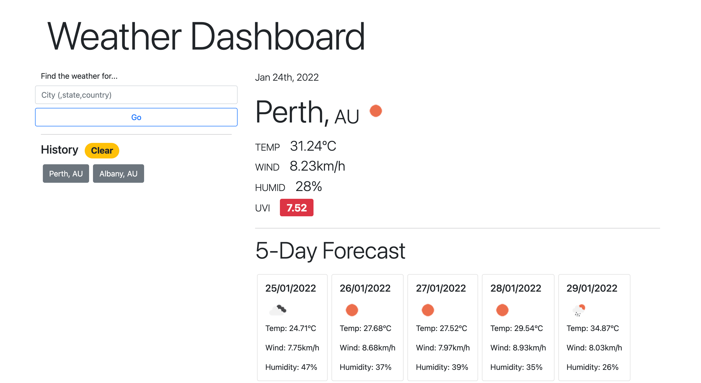

# WheresMyWeather
A web app that stores your favourite locations and gets the weather at each of them, displaying them in a beautiful UI for you to marvel at.

## Functionality
Both the current weather and the 5-Day forecast for the searched for place are displayed on the page and all places searched for are save for revisiting. Icons detailing the conditions are displayed for increased experience and colour indicators show the severity of the current ultraviolet light levels. History can be cleared also.

## Access 
To access the app, follow this [link](https://kbario.github.io/WheresMyWeather/) and to preview it, see the below screenshot. 

